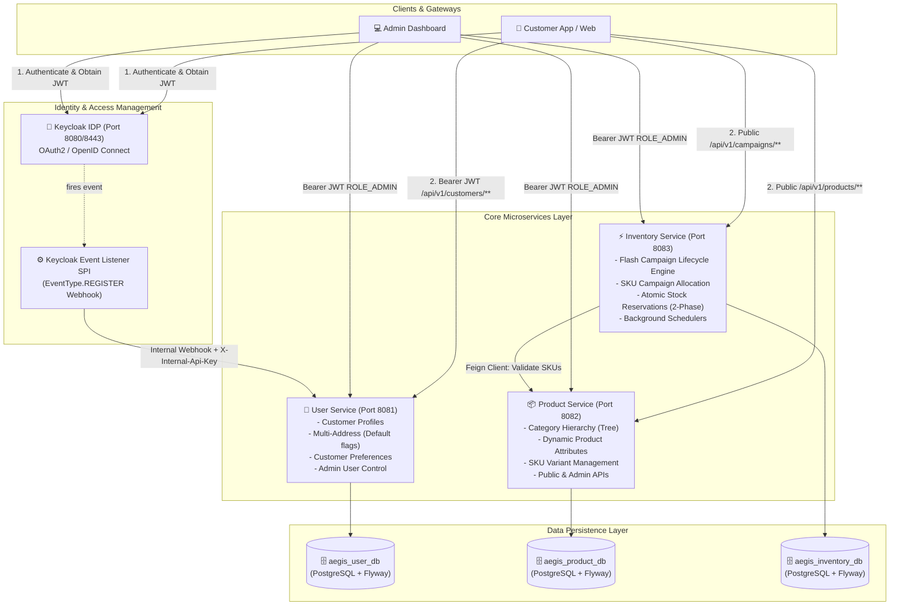
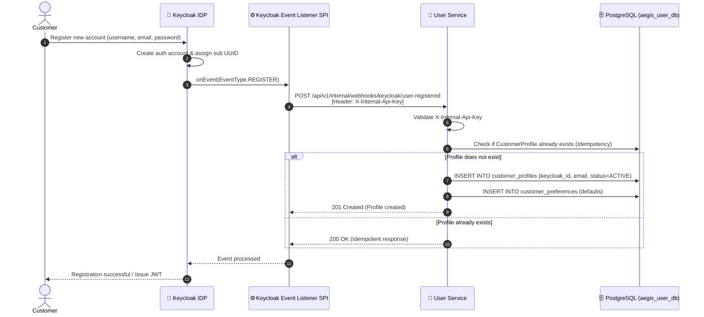
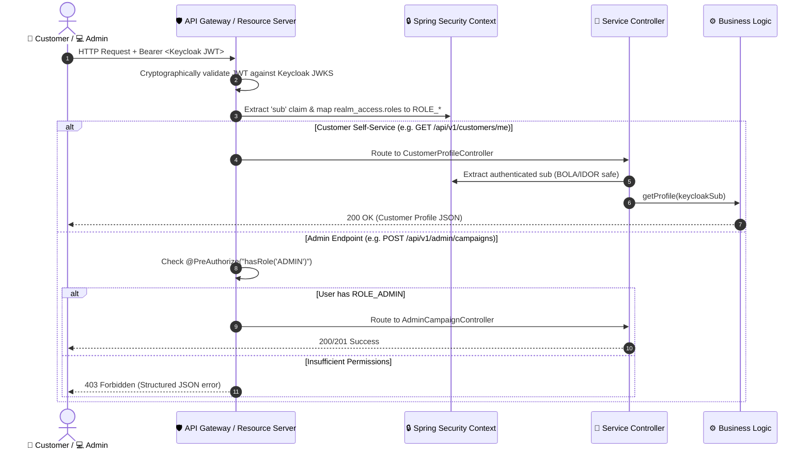
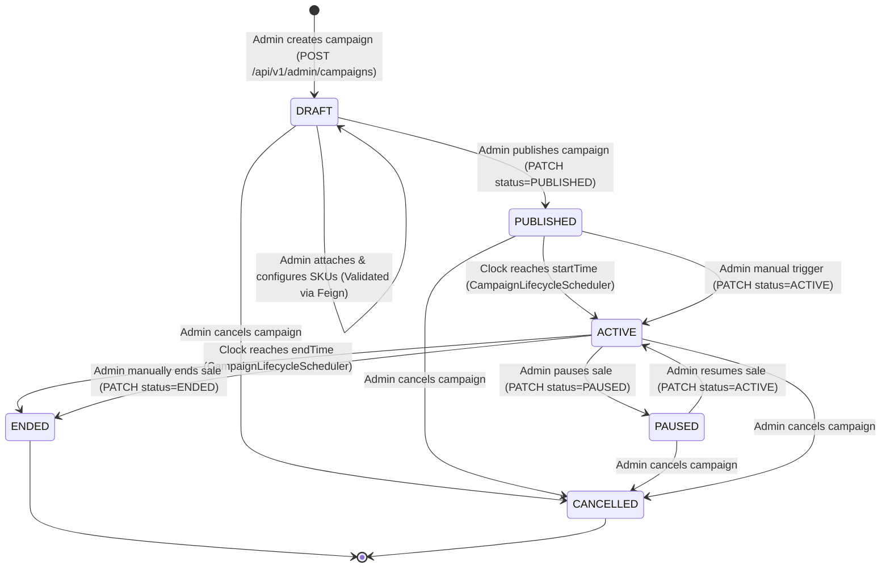
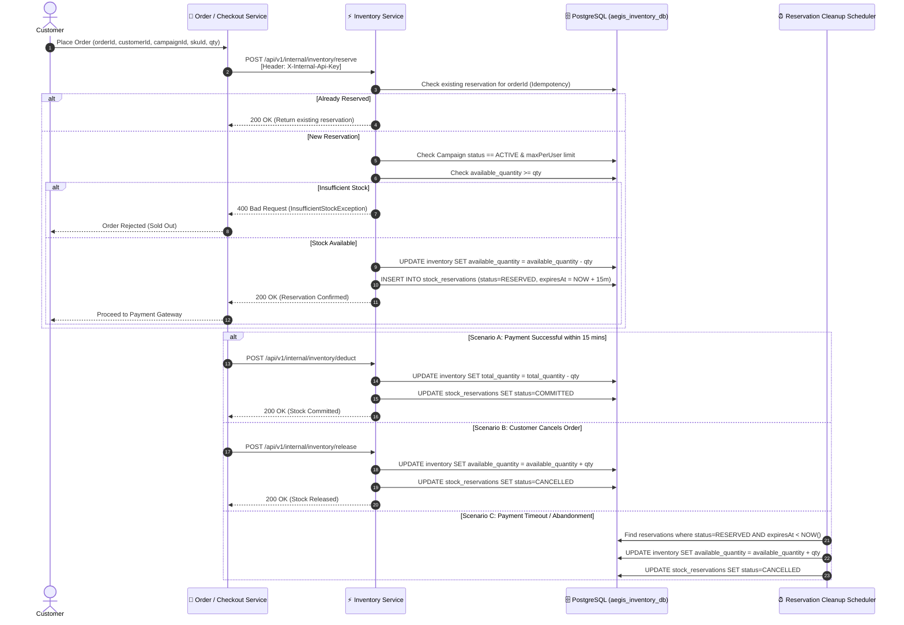
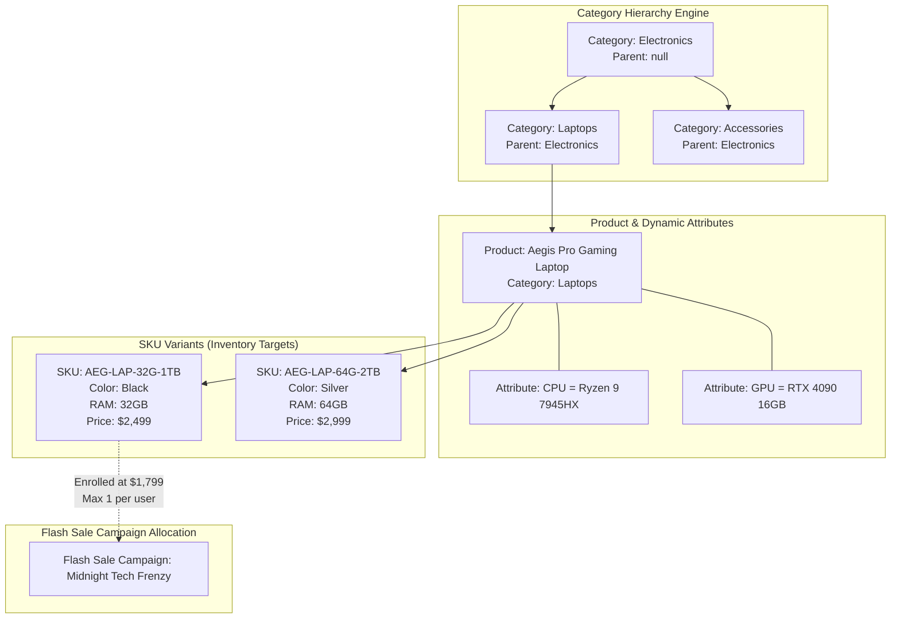
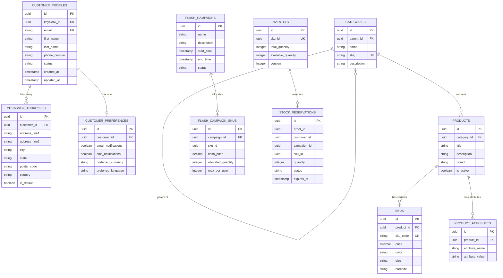

# Project Aegis 🛡️ — Distributed High-Throughput Flash Sale Platform

[](https://www.oracle.com/java/)
[](https://spring.io/projects/spring-boot)
[-blue.svg)](https://spring.io/projects/spring-cloud)
[](https://www.postgresql.org/)
[](https://www.keycloak.org/)
[](https://flywaydb.org/)

**Project Aegis** is an enterprise-grade, distributed microservices platform engineered for high-concurrency e-commerce operations and time-delimited **Flash Sale campaigns**. It implements atomic stock reservations, event-driven identity synchronization, role-based OAuth2 security, and resilient inter-service communication.

---

## 📑 Table of Contents

1. [High-Level Architecture](#-high-level-architecture)
2. [Microservices Breakdown](#-microservices-breakdown)
   - [User Service (`:8081`)](#1-user-service-user-service---port-8081)
   - [Product Service (`:8082`)](#2-product-service-product-service---port-8082)
   - [Inventory Service (`:8083`)](#3-inventory-service-inventory-service---port-8083)
   - [Keycloak Event Listener SPI](#4-keycloak-event-listener-spi-keycloak-event-listener)
3. [End-to-End System Flows & Diagrams](#-end-to-end-system-flows--diagrams)
   - [1. User Registration & Profile Sync Flow](#1-user-registration--profile-synchronization-flow)
   - [2. Authenticated Customer & Admin Security Flow](#2-authenticated-customer--admin-security-flow)
   - [3. Flash Sale Campaign Lifecycle Flow](#3-flash-sale-campaign-lifecycle-flow)
   - [4. Stock Reservation, Commit & Expiration Flow](#4-high-throughput-stock-reservation--checkout-flow)
   - [5. Product & Category Hierarchy Flow](#5-product-and-category-hierarchy-flow)
4. [API Endpoints Reference](#-api-endpoints-reference)
5. [Database Schema & Data Models](#-database-schema--data-models)
6. [Security & Access Control Architecture](#-security--access-control-architecture)
7. [Getting Started & Local Setup](#-getting-started--local-setup)
8. [Configuration & Environment Variables](#-configuration--environment-variables)
9. [Observability & Actuator Metrics](#-observability--actuator-metrics)
10. [High-Concurrency Flash Sale Best Practices & Roadmap](#-high-concurrency-flash-sale-best-practices--roadmap)

---

## 🏗️ High-Level Architecture



---

## 📦 Microservices Breakdown

### 1. User Service (`/user-service` - Port `8081`)

The **User Service** manages customer identity metadata, shipping/billing address books, and notification/currency preferences.

- **Key Responsibilities**:
  - **Automated Profile Provisioning**: Ingests `EventType.REGISTER` events from Keycloak SPI to create customer records idempotently.
  - **BOLA / IDOR Protection**: Resolves customer identity directly from the JWT `sub` (Subject) claim rather than trusting client-provided path parameters.
  - **Address Book Management**: Supports multiple customer addresses with an atomic "Set Default" invariant (resetting previous default addresses).
  - **Customer Preferences**: Tracks marketing opt-in, SMS notifications, and locale/currency settings.
  - **Admin Operations**: Allows administrators to view paginated customer records, inspect profiles, and update customer status (`ACTIVE`, `SUSPENDED`, `DEACTIVATED`).
- **Tech Stack**: Spring Boot, Spring Security OAuth2 Resource Server, Spring Data JPA, PostgreSQL, Flyway, Lombok, Actuator.

---

### 2. Product Service (`/product-service` - Port `8082`)

The **Product Service** serves as the authoritative source of catalog data, product hierarchies, and SKU variants.

- **Key Responsibilities**:
  - **Category Hierarchy**: Multi-level category tree structures (e.g., `Electronics -> Computers -> Laptops`) supporting both flat listing and nested recursive tree representations.
  - **Dynamic Product Attributes**: Key-value attribute management (e.g., `RAM: 16GB`, `Screen: 15.6" OLED`) per product without requiring rigid schema alterations.
  - **SKU Variant Engine**: Multiple SKU records per product representing distinct sellable units (color, size, SKU code, regular price, barcode).
  - **Public Catalog Browsing**: Paginated listings, category-filtered searches, and title-based full-text querying.
- **Tech Stack**: Spring Boot, Spring Security OAuth2 Resource Server, Spring Data JPA, PostgreSQL, Flyway, Lombok, Springdoc OpenAPI.

---

### 3. Inventory Service (`/inventory-service` - Port `8083`)

The **Inventory Service** is the high-performance backbone for stock management and **Flash Sale Campaigns**.

- **Key Responsibilities**:
  - **Flash Sale Campaign State Machine**: Full lifecycle control for campaigns (`DRAFT` → `PUBLISHED` → `ACTIVE` → `PAUSED` → `ENDED` / `CANCELLED`).
  - **Campaign SKU Allocation**: Attaches product SKUs to flash sales with discounted flash pricing, reserved sale allocations, and per-user limits.
  - **Cross-Service SKU Validation**: Utilizes **Spring Cloud OpenFeign** (`ProductClient`) to verify SKU existence in `product-service` before enrolling it into a flash campaign.
  - **Two-Phase Atomic Stock Reservation**:
    1. *Reservation Phase*: Decrements `available_quantity` and creates a `StockReservation` with a configurable timeout (default 15 mins). Supports idempotency via `orderId`.
    2. *Commit / Deduct Phase*: Upon successful order payment, decrements `total_quantity` and commits the reservation (`COMMITTED`).
    3. *Release / Rollback Phase*: Upon cancellation or payment failure, restores `available_quantity` and cancels reservation (`CANCELLED`).
  - **Automated Lifecycle Schedulers (`CampaignLifecycleScheduler`)**:
    - Auto-activates `PUBLISHED` campaigns whose start time has arrived.
    - Auto-ends `ACTIVE` campaigns whose end time has elapsed.
    - Periodically sweeps expired `RESERVED` stock reservations and returns stock to the available pool.
- **Tech Stack**: Spring Boot, Spring Cloud OpenFeign, Spring Security, Spring Data JPA, PostgreSQL, Flyway, Scheduled Tasks.

---

### 4. Keycloak Event Listener SPI (`/keycloak-event-listener`)

A custom Keycloak Service Provider Interface (SPI) extension deployed directly into Keycloak's runtime.

- **Key Responsibilities**:
  - Implements `EventListenerProvider` to intercept `EventType.REGISTER` events in real time.
  - Formats user registration payload (`userId`, `username`, `email`, `firstName`, `lastName`).
  - Dispatches an authenticated HTTP POST webhook to `user-service` at `/api/v1/internal/webhooks/keycloak/user-registered`.
  - Authenticates via the internal shared secret header: `X-Internal-Api-Key`.

---

## 🔄 End-to-End System Flows & Diagrams

### 1. User Registration & Profile Synchronization Flow



---

### 2. Authenticated Customer & Admin Security Flow



---

### 3. Flash Sale Campaign Lifecycle Flow



---

### 4. High-Throughput Stock Reservation & Checkout Flow



---

### 5. Product and Category Hierarchy Flow



---

## 📡 API Endpoints Reference

### 1. User Service (`port: 8081`)

#### 👤 Customer Self-Service (`/api/v1/customers/me`)
| Method | Endpoint | Auth | Description |
|---|---|---|---|
| `GET` | `/api/v1/customers/me` | Customer JWT | Retrieve authenticated customer profile |
| `PUT` | `/api/v1/customers/me` | Customer JWT | Full update of customer profile |
| `PATCH` | `/api/v1/customers/me` | Customer JWT | Partial update of customer profile |
| `GET` | `/api/v1/customers/me/preferences` | Customer JWT | Get customer preferences (marketing, currency) |
| `PUT` | `/api/v1/customers/me/preferences` | Customer JWT | Full update of preferences |
| `PATCH` | `/api/v1/customers/me/preferences` | Customer JWT | Partial update of preferences |
| `POST` | `/api/v1/customers/me/addresses` | Customer JWT | Add new address to address book |
| `GET` | `/api/v1/customers/me/addresses` | Customer JWT | List all addresses for current user |
| `GET` | `/api/v1/customers/me/addresses/{addressId}` | Customer JWT | Get single address by ID |
| `PUT` | `/api/v1/customers/me/addresses/{addressId}` | Customer JWT | Update existing address |
| `DELETE` | `/api/v1/customers/me/addresses/{addressId}` | Customer JWT | Delete an address |
| `PATCH` | `/api/v1/customers/me/addresses/{addressId}/default` | Customer JWT | Mark address as default (resets other defaults) |

#### 👑 Admin Customer Operations (`/api/v1/admin/customers`)
| Method | Endpoint | Auth | Description |
|---|---|---|---|
| `GET` | `/api/v1/admin/customers` | `ROLE_ADMIN` | List all customer profiles (paginated & sorted) |
| `GET` | `/api/v1/admin/customers/{customerId}` | `ROLE_ADMIN` | Get full customer profile by UUID |
| `PATCH` | `/api/v1/admin/customers/{customerId}/status` | `ROLE_ADMIN` | Change status (`ACTIVE`, `SUSPENDED`, `DEACTIVATED`) |
| `DELETE` | `/api/v1/admin/customers/{customerId}` | `ROLE_ADMIN` | Delete customer profile |

#### 🔒 Internal Webhooks (`/api/v1/internal`)
| Method | Endpoint | Auth | Description |
|---|---|---|---|
| `POST` | `/api/v1/internal/webhooks/keycloak/user-registered` | `X-Internal-Api-Key` | Webhook from Keycloak SPI to create profile |

---

### 2. Product Service (`port: 8082`)

#### 🌐 Public Catalog (`/api/v1`)
| Method | Endpoint | Auth | Description |
|---|---|---|---|
| `GET` | `/api/v1/products` | Public | List products (paginated) |
| `GET` | `/api/v1/products/{id}` | Public | Get product details with SKUs and attributes |
| `GET` | `/api/v1/products/search?query=` | Public | Search products by title keyword |
| `GET` | `/api/v1/products/category/{categoryId}` | Public | List products in a category |
| `GET` | `/api/v1/products/{productId}/skus` | Public | List all SKU variants for a product |
| `GET` | `/api/v1/products/skus/{skuId}` | Public / Feign | Get single SKU details (used by Inventory Feign) |
| `GET` | `/api/v1/products/{productId}/attributes` | Public | List dynamic attributes for a product |
| `GET` | `/api/v1/categories` | Public | List categories (paginated) |
| `GET` | `/api/v1/categories/all` | Public | Get all categories as flat list |
| `GET` | `/api/v1/categories/tree` | Public | Get recursive hierarchical category tree |
| `GET` | `/api/v1/categories/{id}` | Public | Get category details by ID |
| `GET` | `/api/v1/categories/search?name=` | Public | Search categories by name |
| `POST` | `/api/v1/categories` | Public / Admin | Create a new category |

#### 👑 Admin Catalog Operations (`/api/v1/admin`)
| Method | Endpoint | Auth | Description |
|---|---|---|---|
| `POST` | `/api/v1/admin/products` | `ROLE_ADMIN` | Create new product |
| `GET` | `/api/v1/admin/products` | `ROLE_ADMIN` | List products with admin details |
| `GET` | `/api/v1/admin/products/{id}` | `ROLE_ADMIN` | Get single product |
| `PUT` | `/api/v1/admin/products/{id}` | `ROLE_ADMIN` | Full update product |
| `PATCH` | `/api/v1/admin/products/{id}` | `ROLE_ADMIN` | Partial update product |
| `DELETE` | `/api/v1/admin/products/{id}` | `ROLE_ADMIN` | Delete product and cascading relations |
| `POST` | `/api/v1/admin/products/{id}/skus` | `ROLE_ADMIN` | Create SKU under product |
| `PUT` | `/api/v1/admin/products/{id}/skus/{skuId}` | `ROLE_ADMIN` | Update SKU |
| `DELETE` | `/api/v1/admin/products/{id}/skus/{skuId}` | `ROLE_ADMIN` | Delete SKU |
| `POST` | `/api/v1/admin/products/{id}/attributes` | `ROLE_ADMIN` | Add attribute to product |
| `PATCH` | `/api/v1/admin/products/{id}/attributes/{name}` | `ROLE_ADMIN` | Update attribute value |
| `DELETE` | `/api/v1/admin/products/{id}/attributes/{name}` | `ROLE_ADMIN` | Delete attribute |
| `PUT` | `/api/v1/admin/categories/{id}` | `ROLE_ADMIN` | Full update category |
| `PATCH` | `/api/v1/admin/categories/{id}` | `ROLE_ADMIN` | Partial update category |
| `DELETE` | `/api/v1/admin/categories/{id}` | `ROLE_ADMIN` | Delete category |

---

### 3. Inventory Service (`port: 8083`)

#### 🌐 Public Flash Campaign Endpoints (`/api/v1/campaigns`)
| Method | Endpoint | Auth | Description |
|---|---|---|---|
| `GET` | `/api/v1/campaigns` | Public | List active / scheduled flash sale campaigns |
| `GET` | `/api/v1/campaigns/{id}` | Public | Get flash sale campaign details |
| `GET` | `/api/v1/campaigns/{id}/skus` | Public | List all flash sale SKUs & discounted prices |
| `GET` | `/api/v1/campaigns/{id}/skus/{skuId}/availability` | Public | Real-time availability check for flash SKU |

#### 👑 Admin Campaign & Stock Management (`/api/v1/admin`)
| Method | Endpoint | Auth | Description |
|---|---|---|---|
| `POST` | `/api/v1/admin/campaigns` | `ROLE_ADMIN` | Create new flash campaign (DRAFT) |
| `GET` | `/api/v1/admin/campaigns` | `ROLE_ADMIN` | List campaigns with filter/pagination |
| `GET` | `/api/v1/admin/campaigns/{id}` | `ROLE_ADMIN` | Get campaign details |
| `PUT` | `/api/v1/admin/campaigns/{id}` | `ROLE_ADMIN` | Update campaign details |
| `PATCH` | `/api/v1/admin/campaigns/{id}/status` | `ROLE_ADMIN` | Change status (`PUBLISHED`, `ACTIVE`, `PAUSED`, `ENDED`, `CANCELLED`) |
| `DELETE` | `/api/v1/admin/campaigns/{id}` | `ROLE_ADMIN` | Delete campaign |
| `POST` | `/api/v1/admin/campaigns/{campaignId}/skus` | `ROLE_ADMIN` | Add SKU to campaign (Feign validated) |
| `GET` | `/api/v1/admin/campaigns/{campaignId}/skus` | `ROLE_ADMIN` | List SKUs for campaign |
| `PUT` | `/api/v1/admin/campaigns/{campaignId}/skus/{skuId}` | `ROLE_ADMIN` | Update campaign SKU limits/price |
| `DELETE` | `/api/v1/admin/campaigns/{campaignId}/skus/{skuId}` | `ROLE_ADMIN` | Remove SKU from campaign |
| `POST` | `/api/v1/admin/inventory` | `ROLE_ADMIN` | Initialize inventory for a SKU |
| `GET` | `/api/v1/admin/inventory/{skuId}` | `ROLE_ADMIN` | View current inventory balances |
| `POST` | `/api/v1/admin/inventory/adjust` | `ROLE_ADMIN` | Increment/decrement stock quantity |

#### 🔒 Internal Stock Reservation APIs (`/api/v1/internal/inventory`)
| Method | Endpoint | Auth | Description |
|---|---|---|---|
| `POST` | `/api/v1/internal/inventory/reserve` | `X-Internal-Api-Key` | Idempotent atomic stock reservation with TTL |
| `POST` | `/api/v1/internal/inventory/deduct` | `X-Internal-Api-Key` | Commit and decrement stock on payment completion |
| `POST` | `/api/v1/internal/inventory/release` | `X-Internal-Api-Key` | Release reserved stock on order cancel/fail |
| `GET` | `/api/v1/internal/inventory/check/{skuId}` | `X-Internal-Api-Key` | Internal stock availability check |

---

## 🗄️ Database Schema & Data Models

Each microservice maintains its own decoupled PostgreSQL database with isolated schema migrations managed by **Flyway**.



---

## 🔒 Security & Access Control Architecture

### 1. OAuth2 / JWT Resource Server Configuration
- Microservices validate JWT tokens against the Keycloak issuer (`${KEYCLOAK_ISSUER_URI}`).
- Custom `KeycloakJwtAuthenticationConverter` maps roles from `realm_access.roles` (e.g. `ADMIN`, `CUSTOMER`) into Spring `GrantedAuthority` records (`ROLE_ADMIN`, `ROLE_CUSTOMER`).

### 2. Broken Object-Level Authorization (BOLA / IDOR) Defense
- Customer endpoints (`/api/v1/customers/me/**`) **never** take a `customerId` path variable.
- The service extracts the caller's Keycloak UUID directly from the authenticated JWT `sub` claim inside `SecurityContextHolder`, making it impossible for a user to query or alter another user's profile.

### 3. Service-to-Service & Webhook Security
- Sensitive internal endpoints (`/api/v1/internal/**`) are guarded by the `X-Internal-Api-Key` filter.
- Requests without a matching pre-shared key receive an immediate `401 Unauthorized`.

### 4. RFC 7807 Structured Exception Handling
All microservices use a global `@RestControllerAdvice` (`GlobalExceptionHandler`) to intercept exceptions and return uniform, machine-readable JSON responses:
```json
{
  "success": false,
  "message": "Requested quantity 5 exceeds max allowed per user 2 for SKU 48c084cf-c44d-44aa-9cfa-81b4fcb512e9",
  "error": "INVALID_OPERATION",
  "timestamp": "2026-08-22T11:58:30Z"
}
```

---

## 🚀 Getting Started & Local Setup

### Prerequisites
- **Java**: JDK 21 or higher
- **Database**: PostgreSQL 15+
- **Identity Provider**: Keycloak 25+
- **Build Tool**: Apache Maven (wrappers included)

---

### Step 1: Database Setup
Create the required databases in PostgreSQL:
```sql
CREATE DATABASE aegis_user_db;
CREATE DATABASE aegis_product_db;
CREATE DATABASE aegis_inventory_db;
```

---

### Step 2: Build All Modules
From the repository root directory:

```bash
# Build Keycloak Event Listener SPI
cd keycloak-event-listener
mvn clean package
cd ..

# Build User Service
cd user-service
.\mvnw.cmd clean package
cd ..

# Build Product Service
cd product-service
.\mvnw.cmd clean package
cd ..

# Build Inventory Service
cd inventory-service
.\mvnw.cmd clean package
cd ..
```

---

### Step 3: Deploy Keycloak Event Listener SPI
Copy the built SPI JAR into your Keycloak `providers/` directory:
```bash
cp keycloak-event-listener/target/keycloak-event-listener-1.0.0.jar /path/to/keycloak/providers/
/path/to/keycloak/bin/kc.sh build
```
In the Keycloak Admin Console:
1. Navigate to **Realm Settings** → **Events** → **Event Listeners**.
2. Add `user-registration-sync` to the active listeners list and save.

---

### Step 4: Run Microservices
Launch each service in separate terminals or as background processes:

```bash
# Terminal 1: User Service (Port 8081)
cd user-service
.\mvnw.cmd spring-boot:run -Dspring-boot.run.profiles=dev

# Terminal 2: Product Service (Port 8082)
cd product-service
.\mvnw.cmd spring-boot:run -Dspring-boot.run.profiles=dev

# Terminal 3: Inventory Service (Port 8083)
cd inventory-service
.\mvnw.cmd spring-boot:run -Dspring-boot.run.profiles=dev
```

---

## ⚙️ Configuration & Environment Variables

Each service reads its runtime properties from environment variables or `application-dev.yaml`.

| Variable | Description | Example / Default |
|---|---|---|
| `SERVER_PORT` | HTTP port for the microservice | `8081` (User), `8082` (Product), `8083` (Inventory) |
| `DB_URL` | JDBC connection URL for PostgreSQL | `jdbc:postgresql://localhost:5432/aegis_inventory_db` |
| `DB_USERNAME` | PostgreSQL database user | `postgres` |
| `DB_PASSWORD` | PostgreSQL database password | `postgres` |
| `KEYCLOAK_ISSUER_URI` | Keycloak OpenID discovery endpoint | `http://localhost:8080/realms/aegis` |
| `INTERNAL_API_KEY` | Shared secret for internal webhooks/APIs | `aegis-super-secret-internal-key-2026` |
| `SERVICE_PRODUCT_URL` | Base URL of Product Service for Feign | `http://localhost:8082` |

---

## 🩺 Observability & Actuator Metrics

Each service exposes Spring Boot Actuator endpoints for health checks, application info, and Prometheus metrics:

| Endpoint | Purpose | URL |
|---|---|---|
| **Health Check** | Component health (DB, disk, liveness) | `http://localhost:<PORT>/actuator/health` |
| **App Info** | Build version & environment details | `http://localhost:<PORT>/actuator/info` |
| **Prometheus** | Metric scraping for Grafana monitoring | `http://localhost:<PORT>/actuator/prometheus` |
| **Swagger UI** | OpenAPI interactive documentation | `http://localhost:<PORT>/swagger-ui/index.html` |

---

## ⚡ High-Concurrency Flash Sale Best Practices & Roadmap

> 📖 **Full Guide & Roadmap**: See the dedicated [System Optimization & High-Throughput Roadmap](file:///c:/A_Drive/project-aegis/OPTIMIZATION_README.md) for the complete master TODO list, architecture diagrams, code blueprints, and deep-dive optimization strategies.

To sustain ultra-high write concurrency during flash events (e.g. 100,000+ RPS), the architecture is prepared for the following evolutions:

1. **Redis Lua Scripts for In-Memory Atomic Reservation**:
   - Cache flash SKU inventory in Redis (`HSET flash_sku:<id> total available`).
   - Execute an atomic Lua script for sub-millisecond stock checks and decrements before hitting the database.
2. **Asynchronous Order Processing (Apache Kafka)**:
   - Transition synchronous reservations to an event-driven queue: `OrderPlacedEvent` → Kafka Topic `flash-orders` → Consumer Batch DB Writer.
3. **API Gateway & Distributed Rate Limiting**:
   - Deploy Spring Cloud Gateway with Redis Token Bucket rate limiting per user and per IP to filter bot scalpers.
4. **Distributed JWT Revocation Denylist**:
   - Push banned user IDs to a low-latency Redis blocklist at the gateway level to instantly revoke compromised tokens.

---

## 📜 License

This project is proprietary and maintained under **Project Aegis**.
