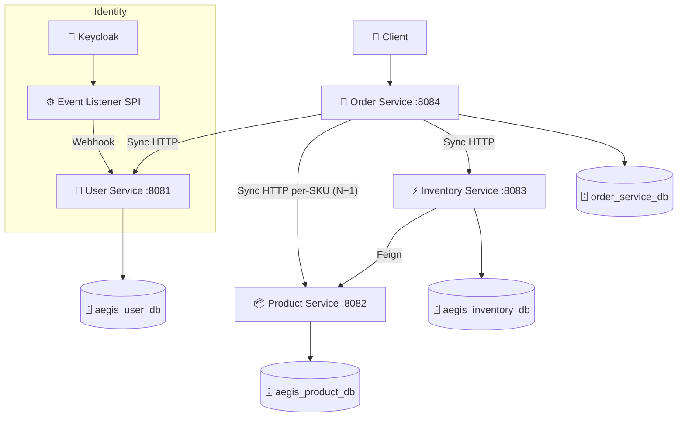
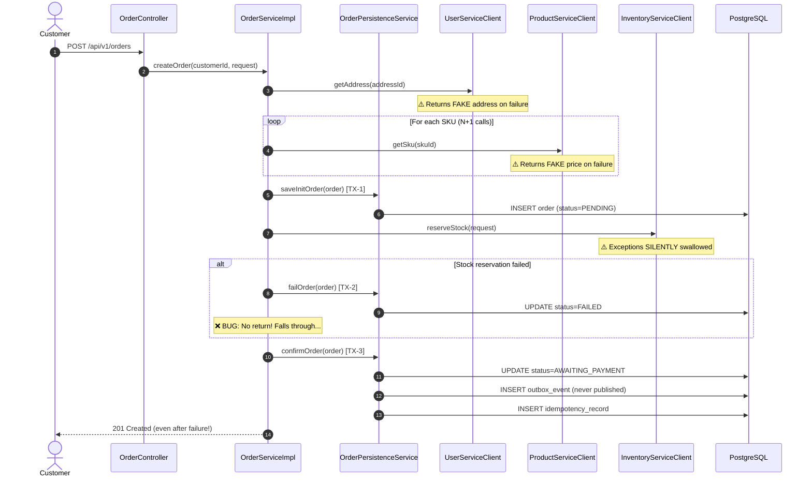
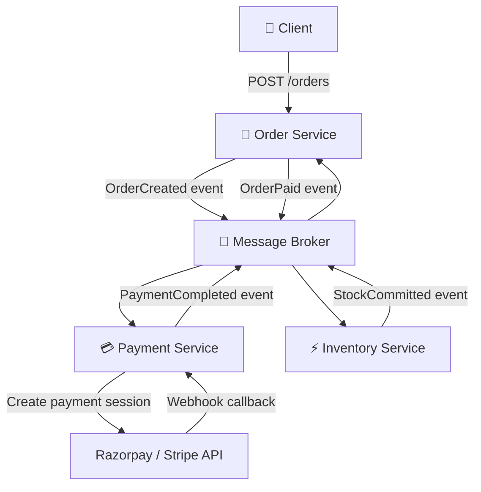
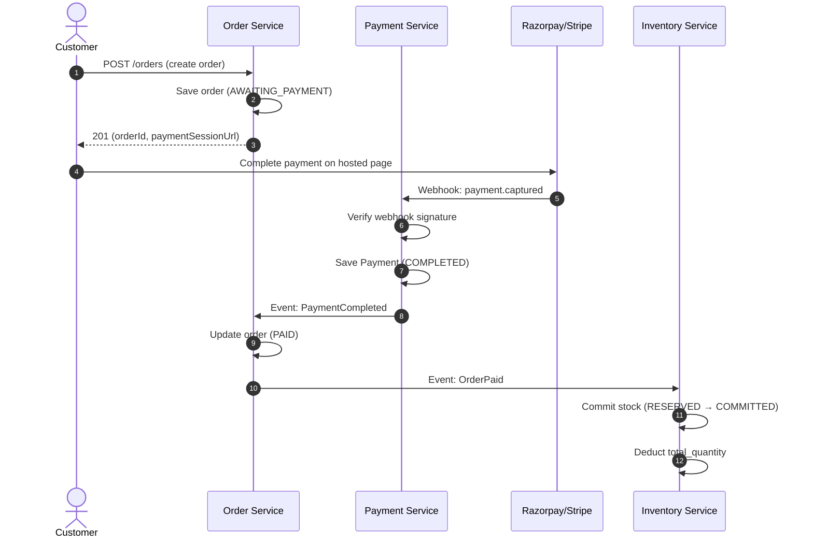
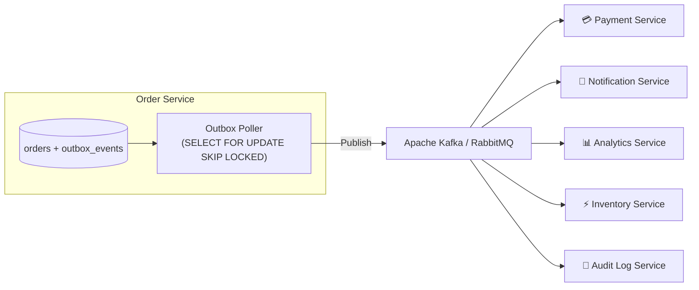
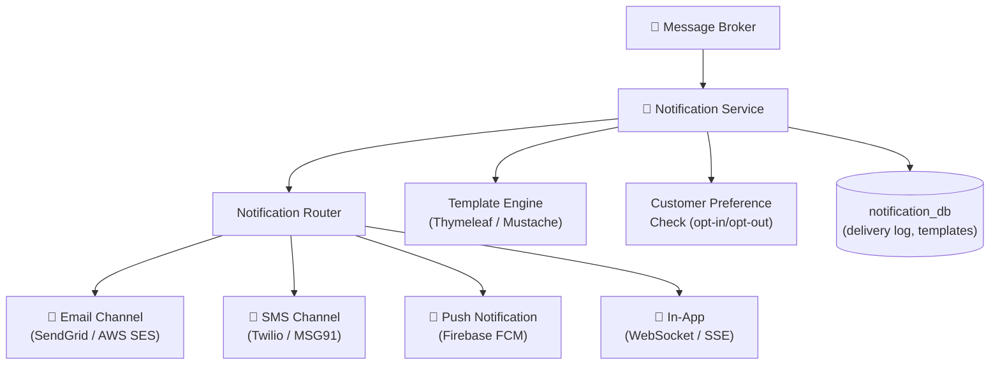
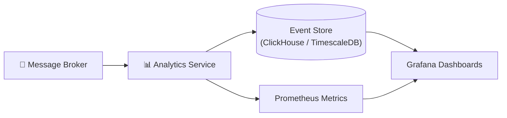
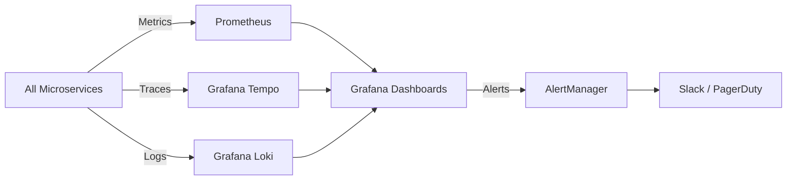
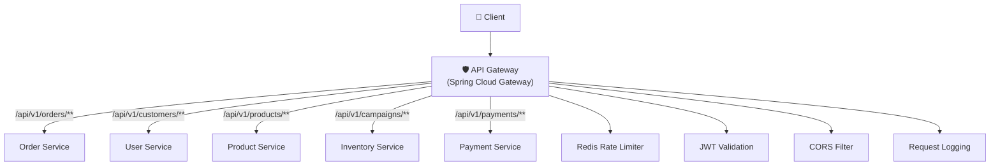
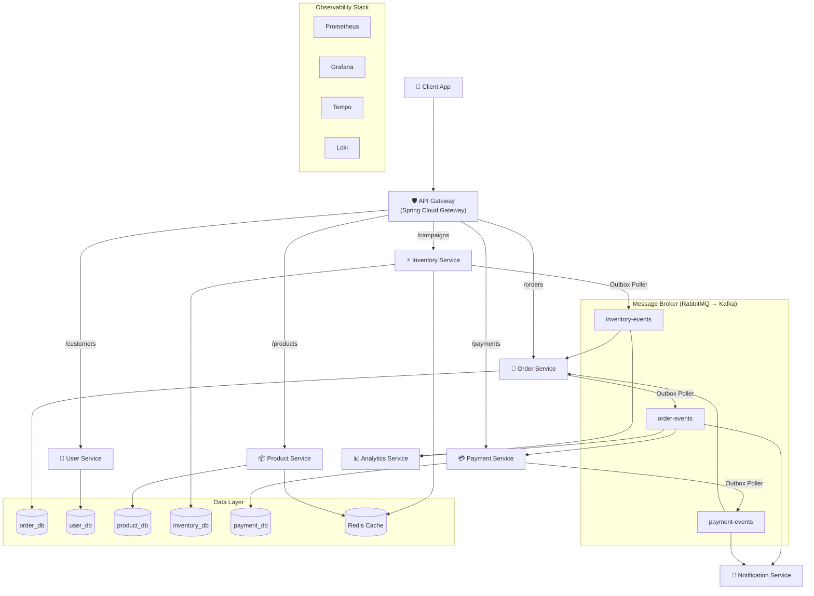

# 🛡️ Project Aegis — Production Readiness & Improvement Plan

> **Goal**: Evolve the current microservices system into a **production-grade, event-driven, payment-integrated platform** with full observability, fault tolerance, and scalability.

---

## Table of Contents

1. [Current Architecture Analysis](#1-current-architecture-analysis)
2. [Critical Bugs & Architectural Flaws](#2-critical-bugs--architectural-flaws)
3. [Order Creation Flow Problems](#3-order-creation-flow-problems)
4. [Transaction & Distributed Consistency Issues](#4-transaction--distributed-consistency-issues)
5. [Idempotency & Duplicate Request Problems](#5-idempotency--duplicate-request-problems)
6. [Payment Integration Requirements](#6-payment-integration-requirements)
7. [Event-Driven Architecture Requirements](#7-event-driven-architecture-requirements)
8. [Notification Service Architecture](#8-notification-service-architecture)
9. [Analytics & Event Processing Architecture](#9-analytics--event-processing-architecture)
10. [Observability, Monitoring & Distributed Tracing](#10-observability-monitoring--distributed-tracing)
11. [Security Improvements](#11-security-improvements)
12. [Performance & Scalability Improvements](#12-performance--scalability-improvements)
13. [Database & Transaction Improvements](#13-database--transaction-improvements)
14. [Retry, Timeout, Circuit Breaker & Fault Tolerance](#14-retry-timeout-circuit-breaker--fault-tolerance)
15. [API Gateway & Service Communication](#15-api-gateway--service-communication)
16. [Deployment, Docker, CI/CD & Infrastructure](#16-deployment-docker-cicd--infrastructure)
17. [Testing Requirements](#17-testing-requirements)
18. [Target Architecture](#18-target-architecture)
19. [Phased Implementation Roadmap](#19-phased-implementation-roadmap)

---

## 1. Current Architecture Analysis

### What Exists Today



### Current Services

| Service | Port | Role | Has Tests? |
|---------|------|------|-----------|
| **User Service** | 8081 | Customer profiles, addresses, preferences | ✅ 3 test classes |
| **Product Service** | 8082 | Catalog, categories, SKUs | ✅ 2 test classes |
| **Inventory Service** | 8083 | Stock reservation, flash campaigns | ✅ 3 test classes |
| **Order Service** | 8084 | Order creation, cancellation, payment callback | ❌ No real tests |
| **Keycloak SPI** | N/A | Registration event webhook | ❌ No tests |

### What's Good (Keep These)

- ✅ Outbox pattern entity exists ([`OutboxEvent.java`](file:///c:/A_Drive/project-aegis/order-service/src/main/java/com/project_aegis/order_service/entity/OutboxEvent.java))
- ✅ Idempotency record entity exists ([`IdempotencyRecord.java`](file:///c:/A_Drive/project-aegis/order-service/src/main/java/com/project_aegis/order_service/entity/IdempotencyRecord.java))
- ✅ Two-phase stock reservation (Reserve → Commit/Rollback)
- ✅ Internal API key authentication for service-to-service calls
- ✅ BOLA/IDOR protection on customer endpoints
- ✅ JWT-based OAuth2 with Keycloak
- ✅ Flyway migrations for schema management
- ✅ Multi-stage Dockerfiles (3 of 4 services)
- ✅ Actuator health/metrics endpoints
- ✅ OpenAPI/Swagger documentation

---

## 2. Critical Bugs & Architectural Flaws

> [!CAUTION]
> These are **show-stopping bugs** that will cause data corruption, lost orders, or inconsistent state in production.

### BUG-1: Order Confirmed Even After Stock Reservation Failure (SEVERITY: P0)

**File**: [`OrderServiceImpl.java#L106-L124`](file:///c:/A_Drive/project-aegis/order-service/src/main/java/com/project_aegis/order_service/service/impl/OrderServiceImpl.java#L106-L124)

```java
// CURRENT BUG: The catch block calls failOrder() but then execution
// FALLS THROUGH to confirmOrder() on line 122 — there is no return/throw!
try {
    reserveStock(savedOrder, customerId, orderBuildResult.reservationItems());
} catch (Exception e) {
    orderPersistenceService.failOrder(savedOrder);  // Sets status to FAILED
    log.error("Stock reservation failed...", e);
    // ❌ BUG: NO return statement! Execution continues to line 122...
}
// This runs EVEN AFTER failure:
Order confirmOrder = orderPersistenceService.confirmOrder(savedOrder, customerId, idempotencyKey);
```

**Impact**: Every failed stock reservation still results in a CONFIRMED order. The customer is charged for items that were never reserved. The order status flips from `FAILED` → `AWAITING_PAYMENT` → saved to DB, creating phantom orders.

**Fix**: Add `return` statement after `failOrder()`, or throw a domain exception.

---

### BUG-2: Silent Failure in Stock Reservation Client (SEVERITY: P0)

**File**: [`InventoryServiceClient.java#L31-L48`](file:///c:/A_Drive/project-aegis/order-service/src/main/java/com/project_aegis/order_service/client/InventoryServiceClient.java#L31-L48)

```java
public void reserveStock(StockReservationClientRequest request) {
    try {
        inventoryRestClient.post()... // Call inventory service
    } catch (Exception ex) {
        log.warn("Failed to call inventory service...");
        // ❌ BUG: Exception is SWALLOWED — caller never knows reservation failed!
    }
}
```

**Impact**: The `OrderServiceImpl.createOrder()` thinks reservation succeeded even when the inventory service is down, returns errors, or times out. Combined with BUG-1, this means **all orders are confirmed regardless of actual stock availability**.

**Fix**: Remove the try-catch, or re-throw a meaningful domain exception. The same silent-swallow bug exists in `releaseStock()` and `decrementStock()`.

---

### BUG-3: Fabricated Prices in Product Service Fallback (SEVERITY: P0)

**File**: [`ProductServiceClient.java#L47-L53`](file:///c:/A_Drive/project-aegis/order-service/src/main/java/com/project_aegis/order_service/client/ProductServiceClient.java#L47-L53)

```java
// Fallback when product service is down:
return SkuClientResponse.builder()
        .price(new BigDecimal("1850.00"))  // ❌ HARDCODED FAKE PRICE
        .productName("Item " + skuId.toString().substring(0, 8))
        .build();
```

**Impact**: If the product service is temporarily unreachable, orders are created with a fabricated ₹1,850 price instead of the real price. This is a financial liability — customers could be overcharged or undercharged.

**Fix**: Fail the order creation with a clear error if the product service is unavailable. Never fabricate financial data.

---

### BUG-4: Fabricated Address in User Service Fallback (SEVERITY: HIGH)

**File**: [`UserServiceClient.java#L47-L55`](file:///c:/A_Drive/project-aegis/order-service/src/main/java/com/project_aegis/order_service/client/UserServiceClient.java#L47-L55)

```java
// Fallback returns a FAKE address:
return CustomerAddressClientResponse.builder()
        .recipientName("Valued Customer")
        .addressLine1("Primary Delivery Address")
        .city("Bengaluru") // ❌ Hardcoded city
        .build();
```

**Impact**: If user-service is unreachable, an order is placed with a fake Bengaluru address. The shipment would be sent to a non-existent address.

---

### BUG-5: Inventory Read-Modify-Write Race Condition (SEVERITY: P0)

**File**: [`InternalInventoryService.java#L107-L116`](file:///c:/A_Drive/project-aegis/inventory-service/src/main/java/com/project_aegis/inventory_service/service/InternalInventoryService.java#L107-L116)

```java
// Non-atomic check-then-update:
if (inventory.getAvailableQuantity() < itemReq.getQuantity()) {  // CHECK
    throw new InsufficientStockException(...);
}
inventory.setAvailableQuantity(inventory.getAvailableQuantity() - itemReq.getQuantity());  // UPDATE
inventoryRepository.save(inventory);
```

**Impact**: Under concurrent requests, two threads can both read `availableQuantity = 1`, both pass the check, and both decrement, resulting in **overselling** (`availableQuantity = -1`). This is the classic lost-update problem.

**Fix**: Use atomic SQL: `UPDATE inventory SET available_quantity = available_quantity - :qty WHERE sku_id = :skuId AND available_quantity >= :qty`.

---

### BUG-6: `createOrder()` Is Not Transactional (SEVERITY: HIGH)

**File**: [`OrderServiceImpl.java#L70`](file:///c:/A_Drive/project-aegis/order-service/src/main/java/com/project_aegis/order_service/service/impl/OrderServiceImpl.java#L70)

The `createOrder()` method has **no `@Transactional` annotation**. The method calls:
1. `orderPersistenceService.saveInitOrder()` — own `@Transactional`
2. `inventoryServiceClient.reserveStock()` — HTTP call
3. `orderPersistenceService.confirmOrder()` — own `@Transactional`

Each `@Transactional` method runs in its own transaction. If step 3 fails (e.g., serialization error in outbox), the order stays in `PENDING` state but stock is already reserved — creating orphaned reservations.

---

### BUG-7: No Outbox Event Poller/Publisher (SEVERITY: HIGH)

The system writes [`OutboxEvent`](file:///c:/A_Drive/project-aegis/order-service/src/main/java/com/project_aegis/order_service/entity/OutboxEvent.java) records to the database but **never reads or publishes them**. There is no scheduled poller, no CDC connector, and no message broker. Outbox events accumulate forever with `status = PENDING` and are never processed.

---

### BUG-8: Admin Status Update Has No Validation (SEVERITY: MEDIUM)

**File**: [`AdminOrderServiceImpl.java#L62`](file:///c:/A_Drive/project-aegis/order-service/src/main/java/com/project_aegis/order_service/service/impl/AdminOrderServiceImpl.java#L62)

```java
order.setStatus(request.getStatus());  // Any status transition is allowed!
```

An admin can set an order from `DELIVERED` → `PENDING`, or `CANCELLED` → `SHIPPED`. There is no state machine validation.

---

### BUG-9: Internal API Key Validation Inconsistency (SEVERITY: MEDIUM)

- In [`InternalOrderServiceImpl.java#L84-L86`](file:///c:/A_Drive/project-aegis/order-service/src/main/java/com/project_aegis/order_service/service/impl/InternalOrderServiceImpl.java#L84-L86): If `configuredKey` is blank, validation is **silently skipped** — any caller can access internal APIs.
- In [`InternalInventoryController.java#L82-L84`](file:///c:/A_Drive/project-aegis/inventory-service/src/main/java/com/project_aegis/inventory_service/controller/internal/InternalInventoryController.java#L82-L84): If `configuredKey` is blank, an `IllegalStateException` is thrown — the service refuses all internal calls.

This inconsistency means a misconfiguration can either lock out legitimate traffic or open up unauthorized access.

---

### BUG-10: Dual ObjectMapper Imports (SEVERITY: LOW)

[`OrderServiceImpl.java`](file:///c:/A_Drive/project-aegis/order-service/src/main/java/com/project_aegis/order_service/service/impl/OrderServiceImpl.java#L29) imports `tools.jackson.databind.ObjectMapper` while [`OrderPersistenceService.java`](file:///c:/A_Drive/project-aegis/order-service/src/main/java/com/project_aegis/order_service/service/impl/OrderPersistenceService.java#L3) imports `com.fasterxml.jackson.databind.ObjectMapper`. These are different classes that could cause serialization mismatches.

---

## 3. Order Creation Flow Problems

### Current Flow (Broken)



### Problems Summary

| # | Problem | Impact |
|---|---------|--------|
| 1 | No `return` after `failOrder()` | Orders confirmed despite stock failure |
| 2 | Exception swallowed in `InventoryServiceClient` | Failure is invisible to caller |
| 3 | Fake price fallback in `ProductServiceClient` | Financial data corruption |
| 4 | Fake address fallback in `UserServiceClient` | Shipments to wrong address |
| 5 | N+1 HTTP calls for SKU fetching (one per item) | High latency, amplified failure risk |
| 6 | No `@Transactional` on `createOrder()` | Partial state corruption |
| 7 | Three separate transactions (TX-1, TX-2, TX-3) | No atomicity across order lifecycle |
| 8 | HTTP calls inside transaction boundaries | Holds DB connections during network I/O |
| 9 | No timeout on HTTP clients | Threads blocked indefinitely on slow services |
| 10 | No retry for transient network failures | Single network blip = failed order |

---

## 4. Transaction & Distributed Consistency Issues

### 4.1 Two-Phase Commit Absence

The order creation spans 3 services (User, Product, Inventory) and 4 databases. There is no distributed transaction coordinator. Each service commits independently.

**Failure Scenario**:
1. Order saved to DB as `PENDING` ✅
2. Stock reserved in inventory-service ✅
3. Power failure before `confirmOrder()` — order stuck in `PENDING` forever, stock reserved but never committed or released.

### 4.2 Saga Pattern Not Implemented

The system needs a **Saga** (either choreography or orchestration) to coordinate cross-service operations with compensating actions:

| Step | Service | Action | Compensating Action |
|------|---------|--------|-------------------|
| 1 | Product | Validate SKUs + prices | N/A (read-only) |
| 2 | User | Validate address | N/A (read-only) |
| 3 | Order | Create order (PENDING) | Delete order |
| 4 | Inventory | Reserve stock | Release stock |
| 5 | Payment | Charge customer | Refund payment |
| 6 | Order | Confirm order (PAID) | Cancel order |

### 4.3 Outbox Pattern Incomplete

The outbox table exists but has no consumer. Events written to `outbox_events` are never:
- Polled by a background worker
- Published to a message broker
- Consumed by downstream services
- Cleaned up after processing

---

## 5. Idempotency & Duplicate Request Problems

### 5.1 Current Idempotency Issues

| Issue | Detail |
|-------|--------|
| Idempotency key is optional | `required = false` on header — most requests have no idempotency protection |
| No TTL on records | `IdempotencyRecord` accumulates forever, no cleanup |
| No unique constraint | Missing `UNIQUE(idempotency_key, customer_id)` — race condition can create duplicate records |
| Scope limited to order creation | Cancellation, payment, and admin operations have no idempotency |
| No locking | Two concurrent requests with the same key can both pass the "find cached" check and create duplicate orders |

### 5.2 Required Improvements

- Add `UNIQUE(idempotency_key, customer_id)` constraint
- Use `INSERT ... ON CONFLICT DO NOTHING` or `SELECT FOR UPDATE` for atomic idempotency check
- Make idempotency key **required** for mutating operations
- Add TTL (e.g., 24 hours) with scheduled cleanup
- Extend idempotency to cancellation and payment endpoints

---

## 6. Payment Integration Requirements

### 6.1 Recommended Architecture



### 6.2 Payment Service Components

| Component | Purpose |
|-----------|---------|
| **Payment Service** (new microservice) | Orchestrates payment lifecycle |
| **Payment Entity** | Stores `paymentId`, `orderId`, `amount`, `currency`, `status`, `gatewayTransactionId`, `gatewayResponse` |
| **Payment Gateway Client** | Integrates with Razorpay/Stripe SDK |
| **Webhook Controller** | Receives payment status callbacks from the gateway |
| **Payment Status Machine** | `INITIATED` → `PROCESSING` → `COMPLETED` / `FAILED` / `REFUNDED` |
| **Idempotency** | Prevent duplicate charges using gateway idempotency keys |
| **Refund Support** | Partial and full refunds via gateway API |

### 6.3 Payment Flow



### 6.4 Recommended Gateway: **Razorpay** (for INR)

Since the system uses INR currency, Razorpay is the best fit:
- Native UPI, card, wallet, netbanking support
- Excellent webhook system
- Built-in idempotency
- India-focused compliance (RBI regulations)
- Java SDK available

---

## 7. Event-Driven Architecture Requirements

### 7.1 Recommended Approach: Transactional Outbox + Message Broker



### 7.2 Domain Events to Publish

| Event | Producer | Consumers | Trigger |
|-------|----------|-----------|---------|
| `OrderCreated` | Order Service | Payment, Notification, Analytics | New order placed |
| `OrderCancelled` | Order Service | Inventory, Payment (refund), Notification, Analytics | Customer cancels |
| `OrderPaid` | Order Service | Inventory (commit stock), Notification, Analytics | Payment confirmed |
| `OrderShipped` | Order Service | Notification, Analytics | Admin sets SHIPPED |
| `OrderDelivered` | Order Service | Notification, Analytics | Admin sets DELIVERED |
| `PaymentCompleted` | Payment Service | Order Service | Gateway webhook |
| `PaymentFailed` | Payment Service | Order Service, Notification | Gateway webhook |
| `StockReserved` | Inventory Service | Order Service | Reservation success |
| `StockReleased` | Inventory Service | Analytics | Reservation cancelled |
| `StockCommitted` | Inventory Service | Analytics | Payment confirmed |
| `CampaignActivated` | Inventory Service | Notification, Product Cache | Campaign goes live |

### 7.3 Outbox Poller Implementation

```java
@Scheduled(fixedDelay = 1000) // Poll every second
@Transactional
public void pollOutboxEvents() {
    List<OutboxEvent> events = outboxEventRepository
        .findPendingEvents(PageRequest.of(0, 50)); // SELECT ... FOR UPDATE SKIP LOCKED
    
    for (OutboxEvent event : events) {
        try {
            kafkaTemplate.send(event.getEventType(), event.getAggregateId().toString(), event.getPayload());
            event.setStatus(OutboxStatus.PUBLISHED);
            event.setProcessedAt(Instant.now());
        } catch (Exception e) {
            event.setRetryCount(event.getRetryCount() + 1);
            if (event.getRetryCount() >= MAX_RETRIES) {
                event.setStatus(OutboxStatus.FAILED);
            }
        }
        outboxEventRepository.save(event);
    }
}
```

### 7.4 Broker Choice

| Option | When to Choose |
|--------|---------------|
| **Apache Kafka** | High throughput, event replay, stream processing, multiple consumers per event |
| **RabbitMQ** | Simpler setup, lower overhead, request-reply patterns, fewer consumers |

> [!IMPORTANT]
> **Recommendation**: Start with **RabbitMQ** for simplicity. Migrate to **Kafka** when you need event replay, stream processing, or >10,000 events/second.

---

## 8. Notification Service Architecture

### 8.1 Service Design



### 8.2 Components

| Component | Purpose |
|-----------|---------|
| **Event Consumer** | Listens to `OrderCreated`, `OrderShipped`, `PaymentFailed`, etc. |
| **Notification Router** | Routes to appropriate channel(s) based on event type and customer preferences |
| **Template Engine** | Renders notification content from templates with event data |
| **Channel Adapters** | Email (SendGrid/SES), SMS (Twilio/MSG91), Push (FCM), In-App (WebSocket) |
| **Delivery Log** | Records every notification sent, delivery status, retry attempts |
| **Preference Service** | Checks customer opt-in/opt-out before sending (reads from user-service) |
| **Rate Limiter** | Prevents notification flooding (max N notifications per user per hour) |

### 8.3 Notification Event Mapping

| Event | Email | SMS | Push | In-App |
|-------|-------|-----|------|--------|
| `OrderCreated` | ✅ Confirmation | ✅ | ✅ | ✅ |
| `OrderPaid` | ✅ Receipt | ❌ | ✅ | ✅ |
| `OrderShipped` | ✅ Tracking | ✅ | ✅ | ✅ |
| `OrderDelivered` | ✅ | ❌ | ✅ | ✅ |
| `OrderCancelled` | ✅ | ❌ | ✅ | ✅ |
| `PaymentFailed` | ✅ | ✅ | ✅ | ✅ |
| `CampaignActivated` | ✅ Marketing | ✅ (opted-in) | ✅ | ✅ |

---

## 9. Analytics & Event Processing Architecture

### 9.1 Architecture



### 9.2 Analytics Events to Capture

| Metric | Source Event | Use Case |
|--------|------------|----------|
| Orders per minute/hour/day | `OrderCreated` | Business KPI |
| Revenue tracking | `OrderPaid` | Financial reporting |
| Cancellation rate | `OrderCancelled` | Customer satisfaction |
| Average order value | `OrderCreated` | Pricing strategy |
| Flash sale burn rate | `StockReserved` | Real-time stock monitoring |
| Payment failure rate | `PaymentFailed` | Gateway health |
| Top-selling SKUs | `StockCommitted` | Inventory planning |
| Customer cohort analysis | All order events | Marketing |

### 9.3 Implementation Options

| Approach | Complexity | Best For |
|----------|-----------|----------|
| **Simple**: Prometheus counters + Grafana | Low | Real-time operational metrics |
| **Medium**: Event consumer → TimescaleDB + Grafana | Medium | Time-series analytics with SQL |
| **Advanced**: Kafka Streams / Flink → ClickHouse | High | High-volume stream processing |

> [!TIP]
> **Start with Prometheus counters** in each service for operational metrics. Add a dedicated analytics consumer writing to TimescaleDB when you need historical business analytics.

---

## 10. Observability, Monitoring & Distributed Tracing

### 10.1 Current State vs. Target

| Capability | Current | Target |
|-----------|---------|--------|
| Health checks | ✅ `/actuator/health` | ✅ + custom indicators |
| Metrics | ✅ Basic Prometheus | Custom business metrics |
| Logging | ✅ SLF4J/Logback | Structured JSON + ELK/Loki |
| Distributed tracing | ❌ None | OpenTelemetry + Tempo/Zipkin |
| Centralized logs | ❌ None | ELK Stack or Grafana Loki |
| Dashboards | ❌ None | Grafana operational dashboards |
| Alerting | ❌ None | PagerDuty / Opsgenie / AlertManager |
| Correlation IDs | ❌ None | W3C Trace Context propagation |

### 10.2 Required Implementation

#### Structured Logging (All Services)
```xml
<!-- logback-spring.xml -->
<encoder class="net.logstash.logback.encoder.LogstashEncoder">
    <includeMdcKeyName>traceId</includeMdcKeyName>
    <includeMdcKeyName>spanId</includeMdcKeyName>
    <includeMdcKeyName>orderId</includeMdcKeyName>
    <includeMdcKeyName>customerId</includeMdcKeyName>
</encoder>
```

#### Distributed Tracing (All Services)
```yaml
# application.yaml
management:
  tracing:
    sampling:
      probability: 1.0  # 100% sampling in dev, lower in prod
  otlp:
    tracing:
      endpoint: http://tempo:4318/v1/traces
```

#### Custom Business Metrics
```java
@Component
public class OrderMetrics {
    private final Counter ordersCreated;
    private final Counter ordersFailed;
    private final Timer orderCreationLatency;
    
    public OrderMetrics(MeterRegistry registry) {
        ordersCreated = Counter.builder("orders.created.total")
            .tag("type", "regular")
            .register(registry);
        ordersFailed = Counter.builder("orders.failed.total")
            .register(registry);
        orderCreationLatency = Timer.builder("orders.creation.latency")
            .register(registry);
    }
}
```

### 10.3 Observability Stack



---

## 11. Security Improvements

### 11.1 Current Vulnerabilities

| Vulnerability | Severity | Location |
|--------------|----------|----------|
| Internal API key bypass when unconfigured | HIGH | `InternalOrderServiceImpl#validateApiKey` |
| `/api/v1/internal/**` is `permitAll()` | HIGH | `SecurityConfig.java` — bypasses JWT validation |
| No rate limiting on any endpoint | MEDIUM | All controllers |
| No CORS configuration | MEDIUM | `cors(AbstractHttpConfigurer::disable)` |
| No request size limits | MEDIUM | No `maxHttpRequestHeaderSize` config |
| Exception messages leak internals | LOW | `GlobalExceptionHandler` — exposes `ex.getMessage()` |
| No input sanitization | MEDIUM | XSS vectors in product names, addresses |
| Actuator endpoints conflict | LOW | Both `permitAll()` and `hasRole('SRE')` for `/actuator/**` |

### 11.2 Required Security Improvements

| Improvement | Priority |
|-------------|----------|
| Fix internal API security to reject when key is unconfigured | P0 |
| Add rate limiting (per-IP and per-user) | P1 |
| Configure CORS properly for frontend domains | P1 |
| Sanitize all user input for XSS/injection | P1 |
| Add request body size limits | P1 |
| Remove internal details from error responses in production | P1 |
| Add API key rotation mechanism | P2 |
| Implement JWT denylist for revoked tokens | P2 |
| Add audit logging for admin operations | P2 |
| Implement Content-Security-Policy headers | P3 |
| Add CAPTCHA/Turnstile on checkout | P3 |

---

## 12. Performance & Scalability Improvements

### 12.1 Immediate Wins

| Improvement | Impact | Effort |
|-------------|--------|--------|
| Enable Java 21 virtual threads | High | Low |
| Batch SKU fetch (eliminate N+1) | High | Medium |
| Add connection pool tuning (HikariCP) | Medium | Low |
| Enable Hibernate batch inserts | Medium | Low |
| Add HTTP client timeouts | High | Low |

### 12.2 Medium-Term Improvements

| Improvement | Impact | Effort |
|-------------|--------|--------|
| L1 cache (Caffeine) for product catalog | High | Medium |
| L2 cache (Redis) for SKUs and campaigns | High | Medium |
| Read-replica routing for read-heavy queries | High | Medium |
| Async order processing for flash sales | Very High | High |
| Redis Lua atomic stock checks | Very High | High |

### 12.3 RestClient Timeout Configuration (Missing)

**File**: [`RestClientConfig.java`](file:///c:/A_Drive/project-aegis/order-service/src/main/java/com/project_aegis/order_service/config/RestClientConfig.java)

The RestClient beans have **zero timeout configuration**. A single slow downstream service will block threads indefinitely.

```java
// REQUIRED: Add to each RestClient builder
RestClient.builder()
    .baseUrl(url)
    .requestFactory(new JdkClientHttpRequestFactory(
        HttpClient.newBuilder()
            .connectTimeout(Duration.ofSeconds(3))
            .build()))
    .build();
```

---

## 13. Database & Transaction Improvements

### 13.1 Missing Indexes

| Table | Missing Index | Purpose |
|-------|--------------|---------|
| `idempotency_records` | `UNIQUE(idempotency_key, customer_id)` | Prevent duplicate idempotency records |
| `outbox_events` | `(status, created_at) WHERE status = 'PENDING'` | Efficient poller queries |
| `orders` | `(customer_id, status)` | Admin search queries |
| `stock_reservations` | `(order_id, status)` | Idempotency check + release queries |

### 13.2 Transaction Boundary Fixes

| Current Problem | Fix |
|----------------|-----|
| HTTP calls inside `@Transactional` | Move HTTP calls outside transaction; only DB writes inside |
| Multiple independent transactions in `createOrder()` | Use a single transaction for order + outbox + idempotency |
| No `@Version` on Order entity | Add optimistic locking with `@Version` |
| No connection pool tuning | Configure HikariCP with explicit settings |

### 13.3 Schema Evolution

```sql
-- Add version column for optimistic locking
ALTER TABLE orders ADD COLUMN version INTEGER NOT NULL DEFAULT 0;

-- Add unique constraint for idempotency
ALTER TABLE idempotency_records 
    ADD CONSTRAINT uq_idempotency_key_customer 
    UNIQUE (idempotency_key, customer_id);

-- Add retry tracking to outbox
ALTER TABLE outbox_events ADD COLUMN retry_count INTEGER NOT NULL DEFAULT 0;
ALTER TABLE outbox_events ADD COLUMN last_error TEXT;

-- Partial index for outbox polling
CREATE INDEX idx_outbox_pending ON outbox_events (created_at) 
    WHERE status = 'PENDING';
```

---

## 14. Retry, Timeout, Circuit Breaker & Fault Tolerance

### 14.1 Current State: No Resilience

No timeouts, no retries, no circuit breakers, no fallbacks exist in any service client.

### 14.2 Required Resilience4j Configuration

```yaml
resilience4j:
  circuitbreaker:
    instances:
      productService:
        sliding-window-size: 20
        failure-rate-threshold: 50
        wait-duration-in-open-state: 10s
        permitted-number-of-calls-in-half-open-state: 5
        record-exceptions:
          - java.io.IOException
          - java.util.concurrent.TimeoutException
      inventoryService:
        sliding-window-size: 20
        failure-rate-threshold: 50
        wait-duration-in-open-state: 10s
      userService:
        sliding-window-size: 20
        failure-rate-threshold: 50
        wait-duration-in-open-state: 10s

  retry:
    instances:
      inventoryService:
        max-attempts: 3
        wait-duration: 500ms
        exponential-backoff-multiplier: 2
        retry-exceptions:
          - java.io.IOException

  timelimiter:
    instances:
      productService:
        timeout-duration: 2s
      inventoryService:
        timeout-duration: 3s
      userService:
        timeout-duration: 2s
```

### 14.3 Failure Handling Strategy

| Failure Scenario | Strategy |
|-----------------|----------|
| Product Service down | **Fail order** — prices are financial data, never fabricate |
| User Service down | **Fail order** — address is required for fulfillment |
| Inventory Service down | **Retry 3x** with exponential backoff, then fail order |
| Payment Gateway timeout | **Retry 3x**, then mark order as `PAYMENT_PENDING` for manual review |
| DB connection exhausted | **Circuit breaker** opens, returns 503 |
| Outbox poller failure | **Retry with backoff**, move to DLQ after 10 attempts |
| Kafka/RabbitMQ down | **Outbox events accumulate in DB**, poller retries |

---

## 15. API Gateway & Service Communication

### 15.1 API Gateway (Spring Cloud Gateway)



### 15.2 Gateway Responsibilities

| Responsibility | Implementation |
|---------------|---------------|
| Request routing | Path-based routing to services |
| Rate limiting | Redis Token Bucket per-IP and per-user |
| JWT validation | Validate Keycloak JWT at the edge |
| CORS | Centralized CORS configuration |
| Request/response logging | Structured access logs |
| Circuit breaker | Per-route circuit breakers |
| Request size limits | Max body size enforcement |
| Load balancing | Round-robin across service instances |

### 15.3 Service Discovery

| Option | When to Choose |
|--------|---------------|
| **Static URLs** (current) | Single instance per service, dev/staging |
| **Spring Cloud Consul/Eureka** | Multiple instances, dynamic scaling |
| **Kubernetes Service DNS** | K8s deployment with built-in service discovery |

---

## 16. Deployment, Docker, CI/CD & Infrastructure

### 16.1 Current State

| Artifact | Exists? | Notes |
|----------|---------|-------|
| Dockerfile (user-service) | ✅ | Multi-stage with Temurin 21 |
| Dockerfile (product-service) | ✅ | Multi-stage with Temurin 21 |
| Dockerfile (inventory-service) | ✅ | Multi-stage with Temurin 21 |
| Dockerfile (order-service) | ❌ | Missing |
| docker-compose.yml | ❌ | Missing — no local orchestration |
| CI/CD pipeline | ❌ | No GitHub Actions / GitLab CI |
| Kubernetes manifests | ❌ | No K8s deployment files |
| Environment management | ❌ | Secrets in config files |

### 16.2 Required Docker Compose

```yaml
# docker-compose.yml (target)
services:
  postgres:
    image: postgres:16-alpine
    # 4 databases via init scripts
  
  keycloak:
    image: quay.io/keycloak/keycloak:25.0
  
  redis:
    image: redis:7-alpine
  
  rabbitmq:  # or kafka
    image: rabbitmq:3-management-alpine
  
  user-service:
    build: ./user-service
    depends_on: [postgres, keycloak]
  
  product-service:
    build: ./product-service
    depends_on: [postgres, keycloak]
  
  inventory-service:
    build: ./inventory-service
    depends_on: [postgres, keycloak, redis]
  
  order-service:
    build: ./order-service
    depends_on: [postgres, keycloak, redis, rabbitmq]
  
  payment-service:
    build: ./payment-service
    depends_on: [postgres, rabbitmq]
  
  notification-service:
    build: ./notification-service
    depends_on: [rabbitmq]
  
  # Observability
  prometheus:
    image: prom/prometheus:latest
  grafana:
    image: grafana/grafana:latest
  tempo:
    image: grafana/tempo:latest
  loki:
    image: grafana/loki:latest
```

### 16.3 CI/CD Pipeline (GitHub Actions)

```yaml
# Required pipeline stages:
# 1. Build + Unit Tests (per service)
# 2. Integration Tests (with Testcontainers)
# 3. Docker Build + Push
# 4. Deploy to Staging
# 5. Smoke Tests
# 6. Deploy to Production (manual approval)
```

---

## 17. Testing Requirements

### 17.1 Current Test Coverage

| Service | Unit Tests | Integration Tests | Contract Tests | E2E Tests |
|---------|-----------|-------------------|----------------|-----------|
| User Service | ✅ 3 classes | ❌ | ❌ | ❌ |
| Product Service | ✅ 2 classes | ❌ | ❌ | ❌ |
| Inventory Service | ✅ 3 classes | ❌ | ❌ | ❌ |
| Order Service | ❌ None | ❌ | ❌ | ❌ |
| Payment Service | N/A (doesn't exist) | N/A | N/A | N/A |

### 17.2 Required Test Categories

| Category | What to Test | Tools |
|----------|-------------|-------|
| **Unit Tests** | Service logic, mappers, validators, state machine | JUnit 5, Mockito |
| **Integration Tests** | Repository queries, REST controllers, security | Testcontainers, Spring Boot Test |
| **Contract Tests** | API contracts between services | Spring Cloud Contract / Pact |
| **Concurrency Tests** | Stock reservation under load | JUnit 5 with ExecutorService |
| **Load/Stress Tests** | System behavior at 10K+ RPS | k6, Gatling |
| **Chaos Tests** | Resilience when services fail | Chaos Monkey for Spring Boot |
| **Security Tests** | Auth bypass, injection, BOLA | OWASP ZAP |

### 17.3 Critical Tests Needed for Order Service

```java
// 1. Stock reservation failure → order should be FAILED
// 2. Duplicate idempotency key → return cached response
// 3. Product service down → order creation fails (not fake prices)
// 4. Concurrent orders for same SKU → no overselling
// 5. Cancel order → stock released
// 6. Payment success → stock committed
// 7. Order state transitions → only valid transitions allowed
```

---

## 18. Target Architecture

### 18.1 Production Architecture Diagram



### 18.2 Service Communication Matrix

```text
┌───────────────────┬──────────────────┬──────────────────┬─────────────────┐
│  Communication    │  Pattern         │  When            │  Technology     │
├───────────────────┼──────────────────┼──────────────────┼─────────────────┤
│  Client → Gateway │  Sync HTTP/REST  │  All requests    │  REST API       │
│  Gateway → Service│  Sync HTTP/REST  │  Request routing │  REST + LB      │
│  Order → Inventory│  Async Event     │  Stock commit    │  Message Broker │
│  Order → Payment  │  Async Event     │  Payment init    │  Message Broker │
│  Payment → Order  │  Async Event     │  Payment result  │  Message Broker │
│  Order → Notif    │  Async Event     │  All order events│  Message Broker │
│  Order → Analytics│  Async Event     │  All order events│  Message Broker │
│  Inv → Product    │  Sync HTTP/REST  │  SKU validation  │  REST (cached)  │
│  Order → User     │  Sync HTTP/REST  │  Address fetch   │  REST (cached)  │
│  Order → Product  │  Sync HTTP/REST  │  SKU/price fetch │  REST (cached)  │
└───────────────────┴──────────────────┴──────────────────┴─────────────────┘
```

---

## 19. Phased Implementation Roadmap

### 🔴 Phase 1: Critical Bug Fixes (Must-Have — Week 1-2)

> Without these, the system is **broken and unsafe for any real traffic**.

- [ ] **Fix BUG-1**: Add `return` after `failOrder()` in `OrderServiceImpl.createOrder()` + throw domain exception
- [ ] **Fix BUG-2**: Remove silent exception swallowing in `InventoryServiceClient` — re-throw meaningful exceptions
- [ ] **Fix BUG-3**: Remove fake price fallback in `ProductServiceClient` — fail the order instead
- [ ] **Fix BUG-4**: Remove fake address fallback in `UserServiceClient` — fail the order instead
- [ ] **Fix BUG-5**: Replace read-modify-write with atomic SQL `UPDATE ... WHERE available_quantity >= :qty`
- [ ] **Fix BUG-6**: Add proper transaction boundary to `createOrder()` — single atomic transaction for order + outbox + idempotency
- [ ] **Fix BUG-8**: Add order state machine validation for admin status updates
- [ ] **Fix BUG-9**: Standardize internal API key validation — always reject when unconfigured
- [ ] **Fix BUG-10**: Standardize ObjectMapper import across all classes
- [ ] **Add unique constraint** on `idempotency_records(idempotency_key, customer_id)`
- [ ] **Add `@Version`** optimistic locking to `Order` entity
- [ ] **Add HTTP client timeouts** to all `RestClient` beans (connect: 3s, read: 5s)
- [ ] **Write unit tests** for `OrderServiceImpl` covering all failure scenarios

---

### 🟠 Phase 2: Production Foundation (Must-Have — Week 3-5)

> These make the system **safe for production deployment**.

- [ ] **Enable Java 21 virtual threads** (`spring.threads.virtual.enabled: true`)
- [ ] **Implement Outbox Event Poller** — scheduled worker with `SELECT FOR UPDATE SKIP LOCKED`
- [ ] **Set up message broker** (RabbitMQ) — topics for order, payment, inventory events
- [ ] **Publish outbox events** to RabbitMQ
- [ ] **Implement Resilience4j** circuit breakers + time limiters on all service clients
- [ ] **Add structured JSON logging** with correlation IDs (`traceId`, `orderId`, `customerId`)
- [ ] **Create Dockerfile** for order-service
- [ ] **Create `docker-compose.yml`** with all services + PostgreSQL + Keycloak + RabbitMQ
- [ ] **Add batch SKU fetch** endpoint in product-service (eliminate N+1)
- [ ] **Fix order creation flow** — validate all inputs before creating order, single transaction for persistence
- [ ] **Add HikariCP tuning** configuration to all services
- [ ] **Add Hibernate batch inserts** configuration
- [ ] **Implement proper CORS** configuration
- [ ] **Add request body size limits**

---

### 🟡 Phase 3: Payment Integration (Must-Have — Week 6-8)

> This enables **actual revenue generation**.

- [ ] **Create Payment Service** (new microservice)
- [ ] **Integrate Razorpay SDK** — create payment sessions, handle webhooks
- [ ] **Implement Payment entity** with full lifecycle (`INITIATED` → `PROCESSING` → `COMPLETED`/`FAILED`/`REFUNDED`)
- [ ] **Payment webhook controller** — verify signatures, update payment status
- [ ] **Publish `PaymentCompleted`/`PaymentFailed`** events to message broker
- [ ] **Order Service consumes payment events** — update order status to PAID/FAILED
- [ ] **Inventory Service consumes `OrderPaid`** event — commit stock (RESERVED → COMMITTED)
- [ ] **Implement refund flow** — `OrderCancelled` after payment → trigger gateway refund
- [ ] **Add payment idempotency** — prevent duplicate charges
- [ ] **Create Payment Service Dockerfile** and add to docker-compose

---

### 🟢 Phase 4: Observability & Monitoring (Important — Week 9-10)

> This enables **production visibility and incident response**.

- [ ] **Add Micrometer + OpenTelemetry** for distributed tracing across all services
- [ ] **Deploy Prometheus** for metrics collection
- [ ] **Deploy Grafana** with dashboards for:
    - Service health (CPU, memory, GC)
    - Request rate, latency (p50/p95/p99), error rate
    - Database connection pool utilization
    - Order creation success/failure rate
    - Payment conversion rate
- [ ] **Deploy Grafana Loki** for centralized log aggregation
- [ ] **Deploy Grafana Tempo** for distributed trace visualization
- [ ] **Add custom business metrics** (orders/min, revenue, cancellation rate)
- [ ] **Configure AlertManager** with alerts for error rate spikes, high latency, DB connection exhaustion
- [ ] **Add health check custom indicators** (DB reachable, broker reachable, Keycloak reachable)

---

### 🔵 Phase 5: Notification Service (Important — Week 11-12)

> This enables **customer communication**.

- [ ] **Create Notification Service** (new microservice)
- [ ] **Implement event consumers** for order lifecycle events
- [ ] **Email integration** (SendGrid or AWS SES) — order confirmation, shipping, delivery
- [ ] **SMS integration** (Twilio or MSG91) — critical alerts (payment failure, shipping)
- [ ] **Template engine** (Thymeleaf) for notification content rendering
- [ ] **Customer preference check** — respect opt-in/opt-out settings
- [ ] **Notification delivery log** — track sent/delivered/failed/bounced
- [ ] **Rate limiting** — prevent notification flooding

---

### 🟣 Phase 6: API Gateway & Security Hardening (Important — Week 13-14)

> This provides **edge security and traffic management**.

- [ ] **Deploy Spring Cloud Gateway** as the unified entry point
- [ ] **Centralize JWT validation** at the gateway
- [ ] **Implement Redis-backed rate limiting** (per-IP and per-user)
- [ ] **Add request logging** at the gateway level
- [ ] **Remove direct service exposure** — all traffic through gateway only
- [ ] **Implement JWT denylist** for revoked tokens
- [ ] **Add audit logging** for all admin operations
- [ ] **Sanitize error responses** — never expose stack traces or internal details
- [ ] **Add CAPTCHA** on checkout for bot protection

---

### ⚪ Phase 7: Caching & Performance (Advanced — Week 15-16)

> This **dramatically improves response times** and **reduces database load**.

- [ ] **Deploy Redis** cluster
- [ ] **L1 cache (Caffeine)** in product-service for category trees (TTL: 60s)
- [ ] **L2 cache (Redis)** for SKU details, active campaigns (TTL: 5 min)
- [ ] **Cache-aside pattern** with automatic eviction on admin updates
- [ ] **HTTP cache headers** (ETag, Cache-Control) for public catalog endpoints
- [ ] **Read-replica routing** — `@Transactional(readOnly=true)` queries to replicas
- [ ] **Database connection pool optimization** across all services

---

### ⬛ Phase 8: Advanced Scalability (Advanced — Week 17-20)

> This enables **high-throughput flash sale operations**.

- [ ] **Redis Lua atomic stock reservation** for flash sales
- [ ] **Flash campaign pre-warming** — preload stock to Redis on activation
- [ ] **Async order processing** via Kafka for flash sale endpoints
- [ ] **Inventory bucketing** for hot-SKU write distribution
- [ ] **Redis-PostgreSQL reconciliation scheduler**
- [ ] **Kafka migration** from RabbitMQ (if event volume demands it)

---

### 🔲 Phase 9: CI/CD & Production Deployment (Advanced — Week 17-18, parallel)

> This enables **automated, safe deployments**.

- [ ] **GitHub Actions CI pipeline** — build, test, lint per service on every PR
- [ ] **Testcontainers integration tests** in CI
- [ ] **Docker image build + push** to container registry
- [ ] **Kubernetes manifests** (Deployments, Services, ConfigMaps, Secrets)
- [ ] **Helm charts** for parameterized deployment
- [ ] **Staging environment** with automated smoke tests
- [ ] **Production deployment** with rolling updates and health checks
- [ ] **Secret management** (Kubernetes Secrets / HashiCorp Vault / AWS Secrets Manager)

---

### 🔳 Phase 10: Testing & Chaos Engineering (Optional/Future)

> This validates **system resilience under adversarial conditions**.

- [ ] **Load testing** with k6/Gatling — simulate 50K concurrent users
- [ ] **Contract tests** (Spring Cloud Contract) between all service pairs
- [ ] **Chaos testing** — random service kills, network partitions, DB failures
- [ ] **Security penetration testing** (OWASP ZAP)
- [ ] **Data integrity validation** — verify zero overselling under concurrent load
- [ ] **Disaster recovery testing** — backup restore, failover

---

### 🟫 Phase 11: Analytics & Future Services (Optional/Future)

> These are **nice-to-have** additions for business intelligence and advanced features.

- [ ] **Analytics Service** — consume events, write to TimescaleDB/ClickHouse
- [ ] **Business dashboards** — revenue, orders, customer cohorts
- [ ] **Search Service** (Elasticsearch) — full-text product search
- [ ] **Recommendation Engine** — "customers also bought"
- [ ] **Admin Dashboard** (frontend) — order management, campaign management
- [ ] **WebSocket/SSE** — real-time order status updates for customers
- [ ] **Multi-region deployment** — for low-latency global access

---

## Summary Priority Matrix

| Category | Phase | Timeline | Risk if Skipped |
|----------|-------|----------|----------------|
| 🔴 **Must-Have (P0)** | Phase 1: Critical Bug Fixes | Week 1-2 | **Data corruption, financial loss** |
| 🟠 **Must-Have (P0)** | Phase 2: Production Foundation | Week 3-5 | **System instability, thread starvation** |
| 🟡 **Must-Have (P1)** | Phase 3: Payment Integration | Week 6-8 | **Cannot generate revenue** |
| 🟢 **Important (P1)** | Phase 4: Observability | Week 9-10 | **Blind to failures, slow incident response** |
| 🔵 **Important (P2)** | Phase 5: Notifications | Week 11-12 | **No customer communication** |
| 🟣 **Important (P2)** | Phase 6: API Gateway + Security | Week 13-14 | **Vulnerable to attacks, no rate limiting** |
| ⚪ **Advanced (P2)** | Phase 7: Caching | Week 15-16 | **High latency, DB bottleneck** |
| ⬛ **Advanced (P3)** | Phase 8: Flash Sale Scalability | Week 17-20 | **Cannot handle high traffic** |
| 🔲 **Advanced (P2)** | Phase 9: CI/CD | Week 17-18 | **Manual, error-prone deploys** |
| 🔳 **Optional** | Phase 10: Chaos/Load Testing | Future | **Unknown failure modes** |
| 🟫 **Optional** | Phase 11: Analytics + Future | Future | **No business intelligence** |

---

> [!IMPORTANT]
> **Start with Phase 1 immediately.** The bugs in the order creation flow (BUG-1 through BUG-6) mean the system currently creates phantom orders, accepts fabricated prices, and confirms orders even when stock reservation fails. None of the later phases matter until these are fixed.

> [!NOTE]
> This plan is designed to be **incremental**. Each phase delivers standalone value and can be deployed independently. You don't need to complete all phases before going to production — Phase 1-3 is the minimum viable production system.
